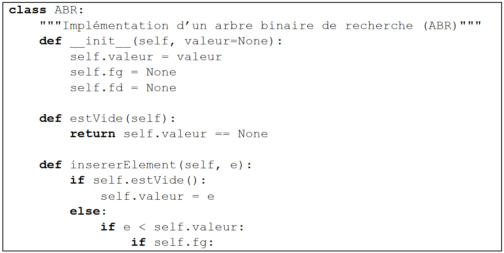
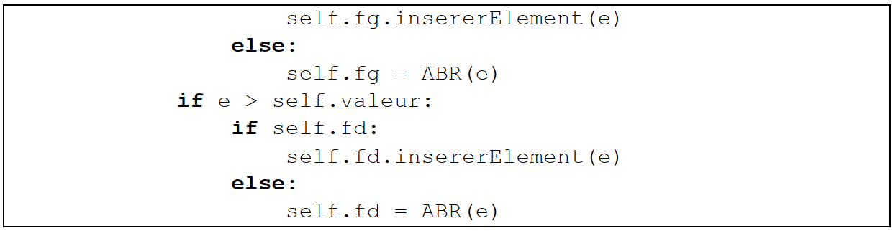
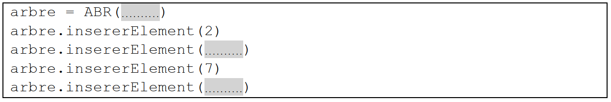

Arbre binaire de recherche (ABR)
================================

Cet exercice traite principalement du thème « algorithmique, langages et
programmation » et en particulier les arbres binaires de recherche. La
première partie aborde les arbres en mode débranché via l’application
d’un algorithme sur un exemple.

La suivante porte sur la programmation orientée objet. La dernière
partie fait le lien avec les algorithmes de tri.

Partie A : Étude d’un exemple
-----------------------------

Considérons l’arbre binaire de recherche ci-dessous.

.. container:: center

   .. image:: ../img/bac1_abr.png
      :alt: image

#. Indiquer quelle valeur a le nœud racine et quels sont les fils de ce
   nœud.

#. Indiquer quels sont les nœuds de la branche qui se termine par la
   feuille qui a pour valeur 3.

#. Dessiner l’arbre obtenu après l’ajout de la valeur 6.

Partie B : Implémentation en Python
===================================

Voici un extrait d’une implémentation en Python d’une classe modélisant
un arbre binaire de recherche.

#. Expliquer le rôle de la fonction \__init_\_.

#. Dans cette implémentation, expliquer ce qui se passe si on ajoute un
   élément déjà présent dans l’arbre.

#. Recopier et compléter les lignes de code surlignées ci-dessous
   permettant de créer l’arbre de la **partie A**. |image|

Partie C : Tri par arbre binaire de recherche
=============================================

On souhaite trier un ensemble de valeurs entières distinctes grâce à un
arbre binaire de recherche. Pour cela, on ajoute un à un les éléments de
l’ensemble dans un arbre initialement vide.

Il ne reste plus qu’à parcourir l’arbre afin de lire et de stocker dans
un tableau résultat les valeurs dans l’ordre croissant.

#. Donner le nom du parcours qui permet de visiter les valeurs d’un
   arbre binaire de recherche dans l’ordre croissant.

#. Comparer la complexité de cette méthode de tri avec celle du tri par
   insertion ou du tri par sélection.

